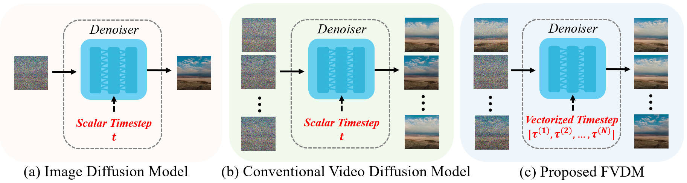
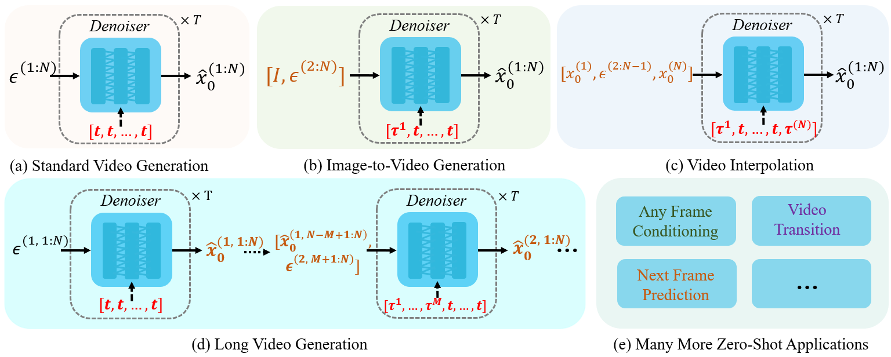

# FVDM

Official Code for Paper **_Redefining Temporal Modeling in Video Diffusion: The Vectorized Timestep Approach_**


> **Authors: [Yaofang Liu](https://scholar.google.com/citations?user=WWb7Y7AAAAAJ&hl=zh-CN), [Yumeng REN](https://scholars.cityu.edu.hk/en/persons/yumeng-ren(88862739-c2ce-47ea-b202-c147e7c07bd6).html), [Xiaodong Cun](https://github.com/vinthony), [Aitor Artola](https://scholar.google.com/citations?user=yDqVoN0AAAAJ&hl=en), [Yang Liu](https://scholar.google.com/citations?user=z2eEUuwAAAAJ), [Tieyong Zeng](https://scholar.google.com/citations?user=2yyTgRwAAAAJ&hl=fr), [Raymond H. Chan](https://scholar.google.com/citations?user=ICiiEOAAAAAJ&hl=en), [Jean-michel Morel](https://scholar.google.fr/citations?user=BlEbdeEAAAAJ&hl=en)**

[](https://arxiv.org/abs/2410.03160)
[](https://github.com/Yaofang-Liu/FVDM)

FVDM (Frame-aware Video Diffusion Model) introduces a novel vectorized timestep variable (VTV) to revolutionize video generation, addressing limitations in current video diffusion models (VDMs). Unlike previous VDMs, our approach allows each frame to follow an independent noise schedule, enhancing the model's capacity to capture fine-grained temporal dependencies. FVDM's flexibility is demonstrated across multiple tasks, including standard video generation, image-to-video generation, video interpolation, and long video synthesis. Through a diverse set of VTV configurations, we achieve superior quality in generated videos, overcoming challenges such as catastrophic forgetting during fine-tuning and limited generalizability in zero-shot methods.

<div align="center"></div>

## Highlights
- Vectorized Timestep Variable (VTV) for fine-grained temporal modeling
- Great flexibility across a wide range of video generation tasks (in a zero-shot way)
- Superior quality in generated videos
- No additional computation cost during training and inference


## Demos
With different VTV configurations, FVDM can be extended to numerous tasks (in a zero-shot way).
<div align="center"></div>

Below are FVDM generated videos w.r.t. datasets FaceForensics, SkyTimelapse, Taichi-HD, and UCF101. Note that the models/checkpoints are the same across different tasks (reflects strong zero-shot capabilities).

https://github.com/user-attachments/assets/1a2c988b-d231-4e7b-9a2d-be1f96e98502


## Setup

```bash
git clone https://github.com/Yaofang-Liu/FVDM.git
cd FVDM
conda env create -f environment.yml
conda activate latte
```

## Code Structure

```
.
├── configs/                # Training and sampling configurations
│   ├── ffs/               # FaceForensics configs
│   ├── sky/               # SkyTimelapse configs
│   ├── taichi/            # Taichi-HD configs
│   ├── ucf101/            # UCF101 configs
│   └── t2v/               # Text-to-Video configs
├── datasets/              # Dataset loaders
├── diffusers/             # Diffusion model components
├── diffusion/             # Gaussian diffusion utilities
├── models/                # Model architectures
├── sample/                # Sampling scripts
├── tools/                 # Evaluation metrics (FVD, FID, IS)
├── train_scripts/         # Training shell scripts
├── train.py               # Base training script
├── train_video.py         # Video training script
└── train_with_img.py      # Video-image joint training script
```

## Training

To train FVDM on different datasets:

```bash
# FaceForensics
bash train_scripts/ffs_train_video.sh

# SkyTimelapse
bash train_scripts/sky_train_video.sh

# Taichi-HD
bash train_scripts/taichi_train_video.sh

# UCF101
bash train_scripts/ucf101_train_video.sh
```

Or use torchrun directly:

```bash
torchrun --nnodes=1 --nproc_per_node=N train_video.py --config ./configs/ffs/ffs_train_video.yaml
```

## Sampling

To generate videos:

```bash
# FaceForensics
bash sample/ffs_video.sh

# SkyTimelapse
bash sample/sky_video.sh

# Taichi-HD
bash sample/taichi_video.sh

# UCF101
bash sample/ucf101_video.sh

# Text-to-Video
bash sample/t2v.sh
```

## Evaluation

We provide evaluation scripts for FVD, FID, and IS metrics:

```bash
bash tools/eval_metrics_ucf101.sh
bash tools/eval_metrics_taichi.sh
```

## Citation

If you find our work useful, please consider citing:

```bibtex
@misc{liu2024redefiningtemporalmodelingvideo,
      title={Redefining Temporal Modeling in Video Diffusion: The Vectorized Timestep Approach},
      author={Yaofang Liu and Yumeng Ren and Xiaodong Cun and Aitor Artola and Yang Liu and Tieyong Zeng and Raymond H. Chan and Jean-michel Morel},
      year={2024},
      eprint={2410.03160},
      archivePrefix={arXiv},
      primaryClass={cs.CV},
      url={https://arxiv.org/abs/2410.03160},
}
```

## Acknowledgments

This implementation is built upon [Latte](https://github.com/maxin-cn/Latte). We thank the authors for their excellent work.

## Contact

For any questions or feedback, please contact yaofanliu2-c@my.cityu.edu.hk.

## License

See [LICENSE](LICENSE) for details.
